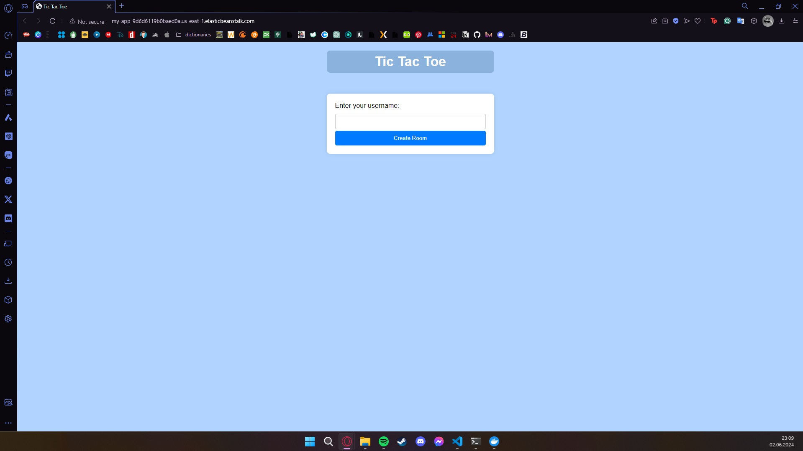
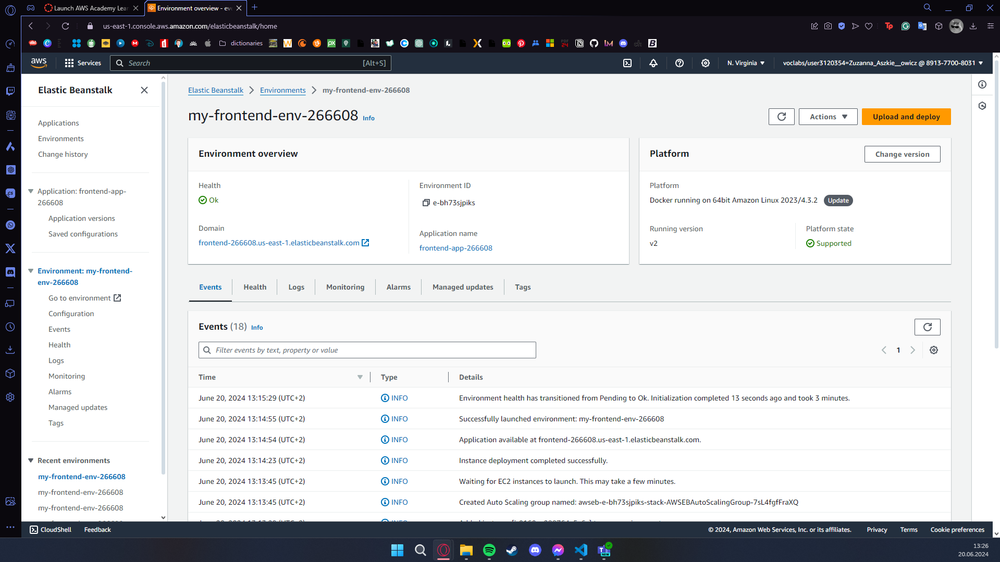
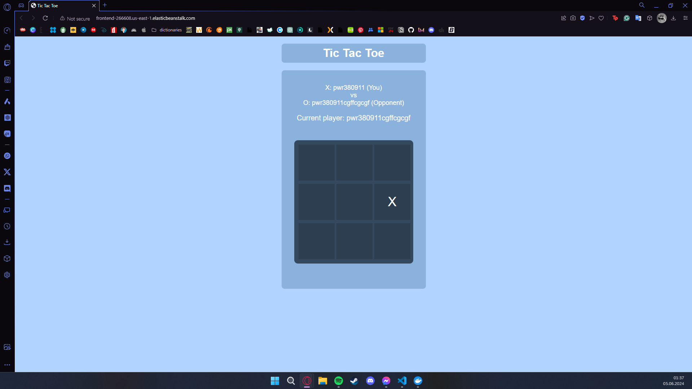
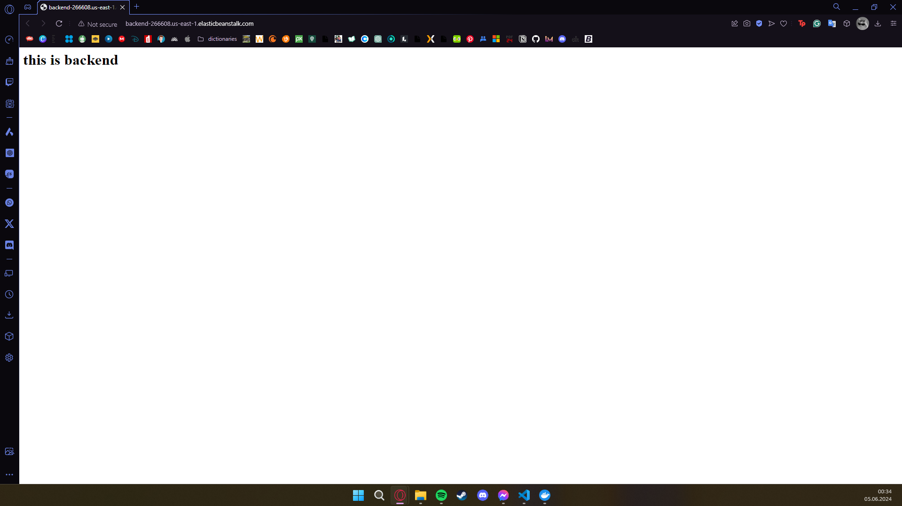
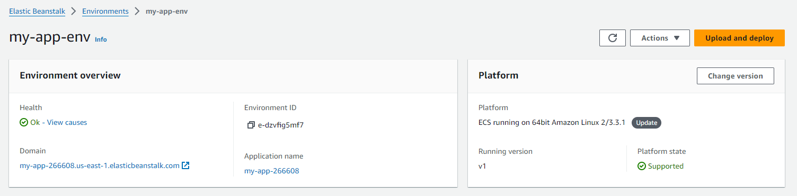
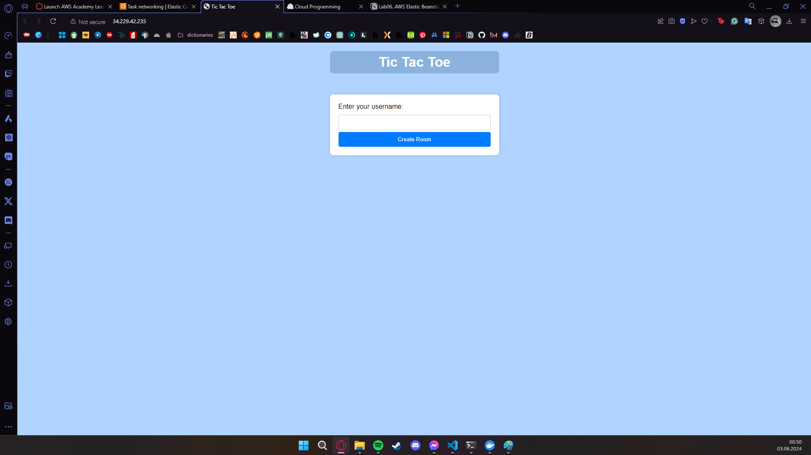
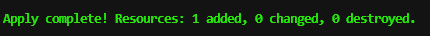

# *Zuzanna Aszkiełowicz - Terraform, EC2, TicTacToe report*

- Course: *Cloud programming*
- Group: Tuesday 11:15-13:00
- Date: 3.06.2024

# Environment architecture

## Beanstalk
This repository contains Terraform configurations to set up the infrastructure for deploying a web application using AWS services. The architecture includes a Virtual Private Cloud (VPC) with public and private subnets, an internet gateway, route tables, security groups, and an Elastic Beanstalk environment.

### **Overview**
1. **VPC (Virtual Private Cloud)**: A logically isolated network for AWS resources.
2. **Subnets**: Two subnets within the VPC - one public and one private.
3. **Internet Gateway**: Allows internet access to resources within the VPC.
4. **Route Tables**: Manages routing within the VPC.
5. **Security Groups**: Controls inbound and outbound traffic to the resources.
6. **Elastic Beanstalk Applications and Environments**: Manages the deployment and scaling of the backend and frontend applications.
7. **S3 Bucket**: Stores application code for Elastic Beanstalk deployment.

### **Detailed Components**
#### VPC
- **CIDR Block**: `10.0.0.0/16`
- **DNS Support**: Enabled
- **DNS Hostnames**: Enabled

#### Subnets
- **Public Subnet**: `10.0.101.0/24` in `us-east-1a`
  - Public IP assignment on launch: Enabled
- **Private Subnet**: `10.0.102.0/24` in `us-east-1b`

#### Internet Gateway
- **Name**: `my_igw`

#### Route Table
- **Route**: `0.0.0.0/0` to Internet Gateway

#### Security Groups
- **Backend Security Group**:
  - **Name**: `backend_sg`
  - **Description**: Allow traffic for Backend
  - **Inbound Rules**:
    - HTTP for backend on port `5000`
  - **Outbound Rules**: All traffic allowed
- **Frontend Security Group**:
  - **Name**: `frontend_sg`
  - **Description**: Allow traffic for Frontend
  - **Inbound Rules**:
    - HTTP for frontend on port `80`
  - **Outbound Rules**: All traffic allowed

#### Elastic Beanstalk
- **Backend Application**:
  - **Application Name**: `backend-app-266608`
  - **Environment Name**: `my-backend-env-266608`
  - **Solution Stack**: `64bit Amazon Linux 2023 v4.3.2 running Docker`
  - **Instance Type**: `t2.small`
  - **Environment Type**: LoadBalanced
  - **Subnets**: Public and Private Subnets
  - **Security Group**: `backend_sg`
  - **Service Role**: `arn:aws:iam::891377008031:role/LabRole`
  - **Supported Architectures**: `x86_64`
  - **Application Version**: `v1`
  - **S3 Bucket**: `app-bucket-266608`
  - **Application Code**: `backend_deploy.zip`
  - **Output URL**: `http://${aws_elastic_beanstalk_environment.backend_env.cname}`

- **Frontend Application**:
  - **Application Name**: `frontend-app-266608`
  - **Environment Name**: `my-frontend-env-266608`
  - **Solution Stack**: `64bit Amazon Linux 2023 v4.3.2 running Docker`
  - **Instance Type**: `t2.small`
  - **Environment Type**: LoadBalanced
  - **Subnets**: Public and Private Subnets
  - **Security Group**: `frontend_sg`
  - **Service Role**: `arn:aws:iam::891377008031:role/LabRole`
  - **Supported Architectures**: `x86_64`
  - **Application Version**: `v2`
  - **S3 Bucket**: `app-bucket-266608`
  - **Application Code**: `frontend_deploy.zip`
  - **Output URL**: `http://${aws_elastic_beanstalk_environment.frontend_env.cname}`

#### S3 Bucket
- **Bucket Name**: `app-bucket-266608`
- **Backend Application Code**: `backend_deploy.zip`
- **Frontend Application Code**: `frontend_deploy.zip`

## Fargate
This repository contains Terraform configurations to set up the infrastructure for deploying a web application using AWS services with ECS Fargate. The architecture includes a Virtual Private Cloud (VPC) with public and private subnets, an internet gateway, route tables, security groups, and an ECS cluster with Fargate tasks for the application.

## Overview

The infrastructure is designed to host a web application on AWS with the following components:

1. **VPC (Virtual Private Cloud)**: A logically isolated network for AWS resources.
2. **Subnets**: Two subnets within the VPC - one public and one private.
3. **Internet Gateway**: Allows internet access to resources within the VPC.
4. **Route Tables**: Manages routing within the VPC.
5. **Security Groups**: Controls inbound and outbound traffic to the resources.
6. **ECS Cluster and Services**: Manages the deployment and scaling of containerized applications using Fargate.

### Detailed Components

#### VPC
- **CIDR Block**: `10.0.0.0/16`
- **DNS Support**: Enabled
- **DNS Hostnames**: Enabled

#### Subnets
- **Public Subnet**: `10.0.101.0/24` in `us-east-1a`
  - Public IP assignment on launch: Enabled
- **Private Subnet**: `10.0.102.0/24` in `us-east-1b`

#### Internet Gateway
- **Name**: `my_igw`

#### Route Table
- **Route**: `0.0.0.0/0` to Internet Gateway

#### Security Group
- **Name**: `server_sg`
- **Inbound Rules**:
  - HTTP for backend on port `5000`
  - HTTP for frontend on port `80`
  - SSH on port `22`
- **Outbound Rules**: All traffic allowed

#### ECS Cluster and Services
- **Cluster Name**: `app-cluster-266608`
- **Task Definition**:
  - **Family**: `app-task-266608`
  - **Network Mode**: `awsvpc`
  - **Requires Compatibilities**: `FARGATE`
  - **CPU**: `512`
  - **Memory**: `1024`
  - **Execution Role ARN**: `LabRole`
  - **Task Role ARN**: `LabRole`
  - **Container Definitions**:
    - **Backend Container**:
      - **Image**: `891377008031.dkr.ecr.us-east-1.amazonaws.com/backend:latest`
      - **Memory**: `256`
      - **Port Mappings**: Host Port `5000`, Container Port `5000`
    - **Frontend Container**:
      - **Image**: `891377008031.dkr.ecr.us-east-1.amazonaws.com/frontend:latest`
      - **Memory**: `256`
      - **Port Mappings**: Host Port `80`, Container Port `80`
- **Service**:
  - **Name**: `app-service-266608`
  - **Cluster**: `app-cluster-266608`
  - **Task Definition**: `app-task-266608`
  - **Launch Type**: `FARGATE`
  - **Desired Count**: `2`
  - **Network Configuration**:
    - **Subnets**: Public and Private Subnets
    - **Security Groups**: `server_sg`
    - **Assign Public IP**: `true`

# Preview

Screenshots of configured AWS services. Screenshots of your application running.

## Working for Beanstalk

## Working for Fargate

# Reflections

- **What did you learn?** 
I empowered my competencies in problem-solving, that's for sure, as well as patience. Also, I deepend my knowledge in terraform configuration. Last but DEFINITELY not least, how to define the app architecture using Beanstalk and Fargate. Fargate was very pleasant!

- **What obstacles did you overcome?** 
In Beanstalk, the biggest obstacle for me was just setting up the environment, specifically, making it work. I followed so many tutorials, watched lots of videos, went through the previous lists, asked ChatGPT, asked Google, asked GitHub Copilot, and my configuration (which eventually worked) didn't cooperate with me. It was pretty clear to follow the tutorials and set up all the resources, and I couldn't really find the mistake in my `main.tf`, nor in the very application. 
Also I had a problem with backend working. It wasn't connecting to the backend. The thing I had to fix was changing localhost to the backend address, and... moving `requirements.txt` to `src/` directory, because without it even after changing the address it wasn't working. Also I decided to run two separate apps and environment for this (before I had it in one), to be able to better track the progress.

- **What did you help most in overcoming obstacles?** 
The thing that *actually* helped me was, well... me, myself, and I (and my ability to read and analyze logs). Since I couldn't really find the problem in the configuration, I had to rely on my problem-solving skills, which I applied in breaking down the problem. I commented out the whole configuration, and began to uncomment it part by part, to see where the problem is. So I was planning out the stages, and applying them, and with that it appeared that there was no problem at all actually. As I did it this way, I applied everything successfully!

- **Was that something that surprised you?**  
It's always surprising for me how I repeat the same step over and over again, and it doesn't work, but suddenly it starts working. It's so amazing. I love when things work. I'm never happier than when I can see how the thing I've built works as (not) expected. One of my favorite views: 
