# *Zuzanna Aszkiełowicz - Terraform, EC2, TicTacToe report*

- Course: *Cloud programming*
- Group: Tuesday 11:15-13:00
- Date: 3.06.2024

# Environment architecture

## Beanstalk
This repository contains Terraform configurations to set up the infrastructure for deploying a web application using AWS services. The architecture includes a Virtual Private Cloud (VPC) with public and private subnets, an internet gateway, route tables, security groups, and an Elastic Beanstalk environment.

### **Overview**
1. **VPC (Virtual Private Cloud)**: A logically isolated network for AWS resources.
2. **Subnets**: Two subnets within the VPC - one public and one private.
3. **Internet Gateway**: Allows internet access to resources within the VPC.
4. **Route Tables**: Manages routing within the VPC.
5. **Security Groups**: Controls inbound and outbound traffic to the resources.
6. **Elastic Beanstalk Applications and Environments**: Manages the deployment and scaling of the backend and frontend applications.
7. **S3 Bucket**: Stores application code for Elastic Beanstalk deployment.

### **Detailed Components**
#### VPC
- **CIDR Block**: `10.0.0.0/16`
- **DNS Support**: Enabled
- **DNS Hostnames**: Enabled

#### Subnets
- **Public Subnet**: `10.0.101.0/24` in `us-east-1a`
  - Public IP assignment on launch: Enabled
- **Private Subnet**: `10.0.102.0/24` in `us-east-1b`

#### Internet Gateway
- **Name**: `my_igw`

#### Route Table
- **Route**: `0.0.0.0/0` to Internet Gateway

#### Security Groups
- **Backend Security Group**:
  - **Name**: `backend_sg`
  - **Description**: Allow traffic for Backend
  - **Inbound Rules**:
    - HTTP for backend on port `5000`
  - **Outbound Rules**: All traffic allowed
- **Frontend Security Group**:
  - **Name**: `frontend_sg`
  - **Description**: Allow traffic for Frontend
  - **Inbound Rules**:
    - HTTP for frontend on port `80`
  - **Outbound Rules**: All traffic allowed

#### Elastic Beanstalk
- **Backend Application**:
  - **Application Name**: `backend-app-266608`
  - **Environment Name**: `my-backend-env-266608`
  - **Solution Stack**: `64bit Amazon Linux 2023 v4.3.2 running Docker`
  - **Instance Type**: `t2.small`
  - **Environment Type**: LoadBalanced
  - **Subnets**: Public and Private Subnets
  - **Security Group**: `backend_sg`
  - **Service Role**: `arn:aws:iam::891377008031:role/LabRole`
  - **Supported Architectures**: `x86_64`
  - **Application Version**: `v1`
  - **S3 Bucket**: `app-bucket-266608`
  - **Application Code**: `backend_deploy.zip`
  - **Output URL**: `http://${aws_elastic_beanstalk_environment.backend_env.cname}`

- **Frontend Application**:
  - **Application Name**: `frontend-app-266608`
  - **Environment Name**: `my-frontend-env-266608`
  - **Solution Stack**: `64bit Amazon Linux 2023 v4.3.2 running Docker`
  - **Instance Type**: `t2.small`
  - **Environment Type**: LoadBalanced
  - **Subnets**: Public and Private Subnets
  - **Security Group**: `frontend_sg`
  - **Service Role**: `arn:aws:iam::891377008031:role/LabRole`
  - **Supported Architectures**: `x86_64`
  - **Application Version**: `v2`
  - **S3 Bucket**: `app-bucket-266608`
  - **Application Code**: `frontend_deploy.zip`
  - **Output URL**: `http://${aws_elastic_beanstalk_environment.frontend_env.cname}`

#### S3 Bucket
- **Bucket Name**: `app-bucket-266608`
- **Backend Application Code**: `backend_deploy.zip`
- **Frontend Application Code**: `frontend_deploy.zip`

## Fargate
This repository contains Terraform configurations to set up the infrastructure for deploying a web application using AWS services with ECS Fargate. The architecture includes a Virtual Private Cloud (VPC) with public and private subnets, an internet gateway, route tables, security groups, and an ECS cluster with Fargate tasks for the application.

## Overview

The infrastructure is designed to host a web application on AWS with the following components:

1. **VPC (Virtual Private Cloud)**: A logically isolated network for AWS resources.
2. **Subnets**: Two subnets within the VPC - one public and one private.
3. **Internet Gateway**: Allows internet access to resources within the VPC.
4. **Route Tables**: Manages routing within the VPC.
5. **Security Groups**: Controls inbound and outbound traffic to the resources.
6. **ECS Cluster and Services**: Manages the deployment and scaling of containerized applications using Fargate.

### Detailed Components

#### VPC
- **CIDR Block**: `10.0.0.0/16`
- **DNS Support**: Enabled
- **DNS Hostnames**: Enabled

#### Subnets
- **Public Subnet**: `10.0.101.0/24` in `us-east-1a`
  - Public IP assignment on launch: Enabled
- **Private Subnet**: `10.0.102.0/24` in `us-east-1b`

#### Internet Gateway
- **Name**: `my_igw`

#### Route Table
- **Route**: `0.0.0.0/0` to Internet Gateway

#### Security Group
- **Name**: `server_sg`
- **Inbound Rules**:
  - HTTP for backend on port `5000`
  - HTTP for frontend on port `80`
  - SSH on port `22`
- **Outbound Rules**: All traffic allowed

#### ECS Cluster and Services
- **Cluster Name**: `app-cluster-266608`
- **Task Definition**:
  - **Family**: `app-task-266608`
  - **Network Mode**: `awsvpc`
  - **Requires Compatibilities**: `FARGATE`
  - **CPU**: `512`
  - **Memory**: `1024`
  - **Execution Role ARN**: `LabRole`
  - **Task Role ARN**: `LabRole`
  - **Container Definitions**:
    - **Backend Container**:
      - **Image**: `891377008031.dkr.ecr.us-east-1.amazonaws.com/backend:latest`
      - **Memory**: `256`
      - **Port Mappings**: Host Port `5000`, Container Port `5000`
    - **Frontend Container**:
      - **Image**: `891377008031.dkr.ecr.us-east-1.amazonaws.com/frontend:latest`
      - **Memory**: `256`
      - **Port Mappings**: Host Port `80`, Container Port `80`
- **Service**:
  - **Name**: `app-service-266608`
  - **Cluster**: `app-cluster-266608`
  - **Task Definition**: `app-task-266608`
  - **Launch Type**: `FARGATE`
  - **Desired Count**: `2`
  - **Network Configuration**:
    - **Subnets**: Public and Private Subnets
    - **Security Groups**: `server_sg`
    - **Assign Public IP**: `true`

# Preview

Screenshots of configured AWS services. Screenshots of your application running.

## ECR
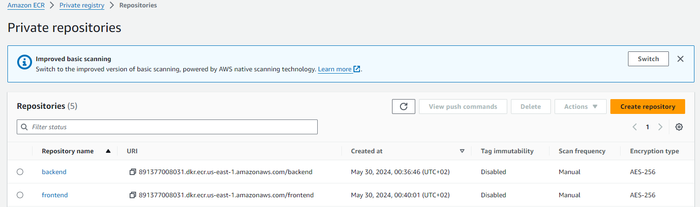

## Working for Beanstalk
### App

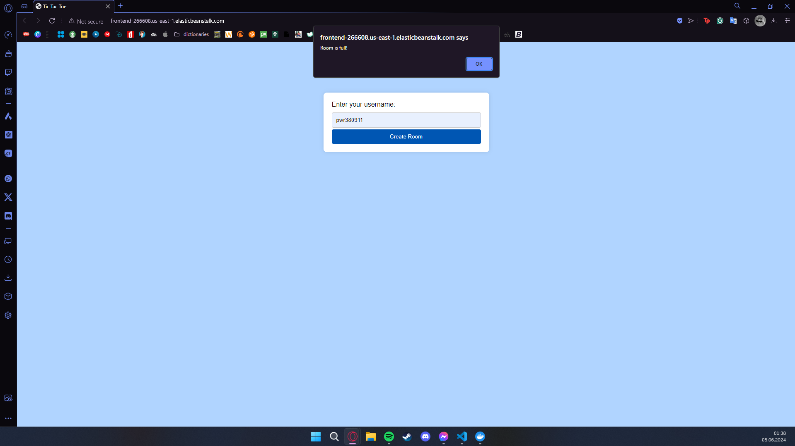

<!-- 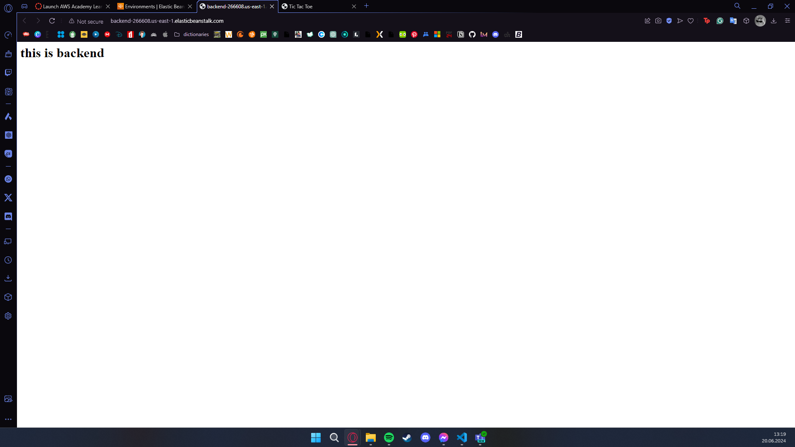 -->
### Services
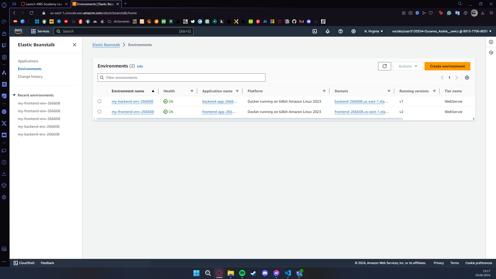
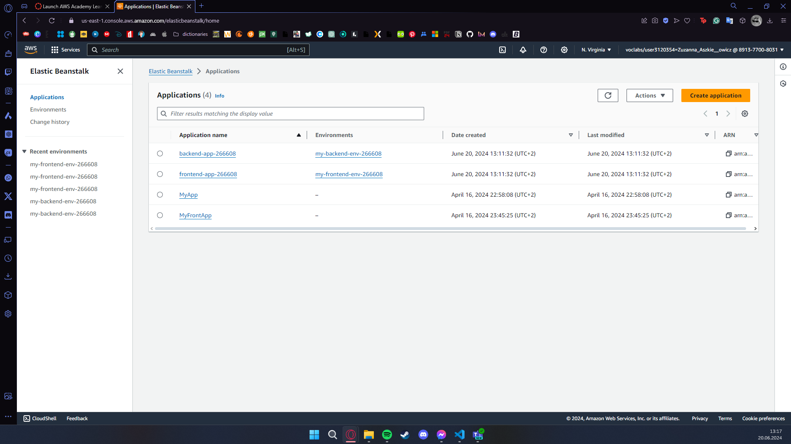

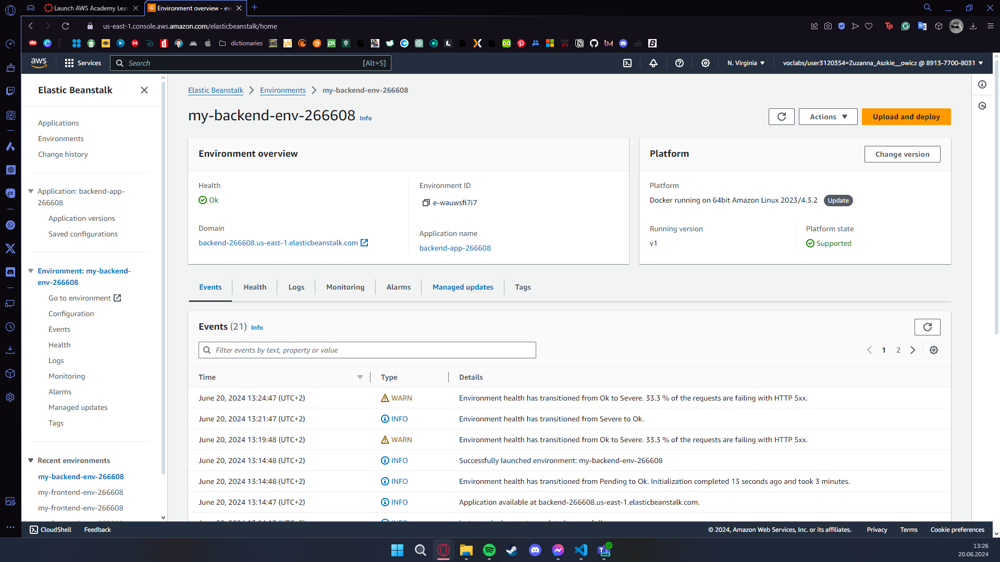
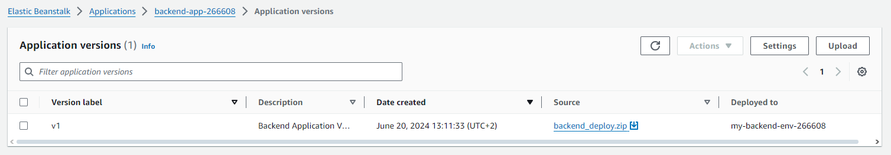
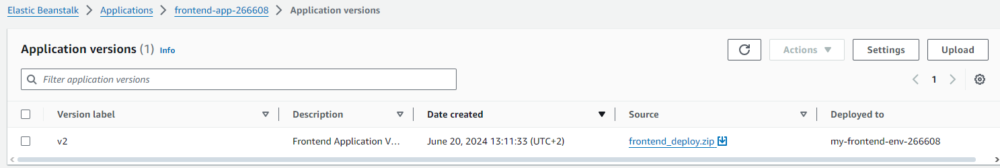

## Working for Fargate

### Services
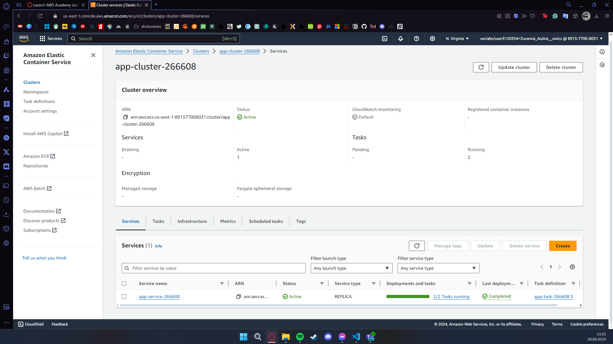
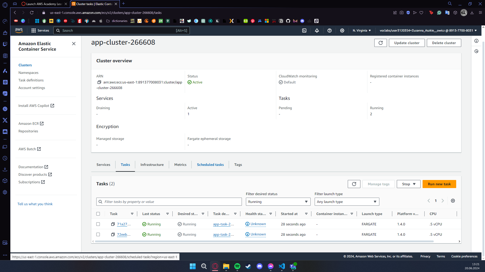
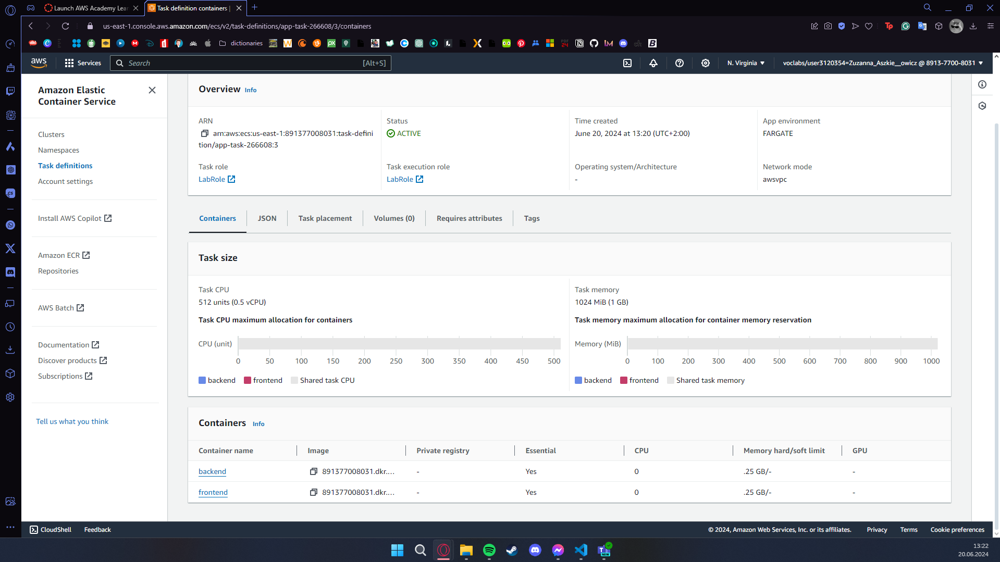
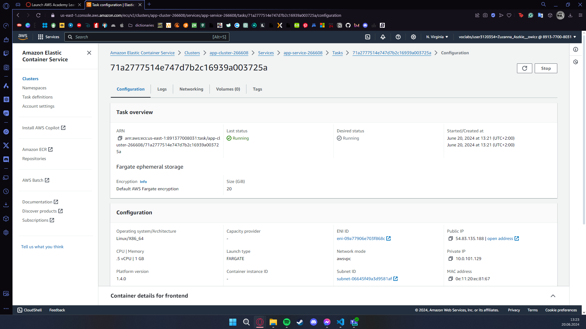

# Reflections

- **What did you learn?** 
I learnt how to set up an application with terraform using Beanstalk and Fargate. Specifically speaking, not only the terraform configuration, but also other aspects of application, such as how to choose the `solution_stack_name`, and how to create the `Dockerrun.aws.json` thoughtfully, e.g. knowing which version to choose.

- **What obstacles did you overcome?** 
  - The first issue I encountered was related to applying my terraform configuration. It was taking so much time and then resulting in failure, which was very frustrating.
  - In the `solution_stack_name` part, Elastic Container Service, which I used first, didn't support my `app.zip` file with the whole configuration. Having changed that to the Docker, the confugration was applied, however it didn't work, as I used the wrong version of the `Dockerrun.aws.json`, which didn't support the `64bit Amazon Linux 2023 v4.3.2 running Docker`. I was using version `2`, which was for ECS managed Docker environments, but as I changed from ECS to Docker, I had to change the version too. I changed it to `1` and `3` for testing, but for my one `app.zip` neither was working. Hence, I divided my app into 2 zips, each for backend and frontend with Dockerrun version 1 (as it was the one supporting my architecture), and generally I splitted my resources into parts for backend and frontend. Having done that, I succeeded in setting up both environments and apps.
  - However, after I managed to apply my configuration and set up environment and application for my TicTacToe, it turned out that backend was not connecting with frontend, even though on localhost it was working perfectly for some reason. It was working neither for Beanstalk nor Fargate, as they were using the same backend image, which kept exiting unexpectedly. So it was a double problem—first, I couldn't have the backend running, and thus I couldn't connect frontend with backend. The problem here was that the `requirements.txt` were placed in the wrong directory, so they were not downloaded correctly. Having moved it to the `src`, where it should be, the image stopped exiting itself, however frontend and backend still wouldn't connect. Of course it wouldn't–I had set `localhost` instead of the correct Beanstalk address. After replacing it with the backend address (`http://backend-266608.us-east-1.elasticbeanstalk.com`), it started working perfectly.
  - Due to my images not working, I couldn't also set up Fargate. Even though the configuration was applied successfully, the backend and frontend wouldn't communicate. As I was using the same images for backend and frontend, fixing it as mentioned above, also helped in making Fargate work.  
Generally In Beanstalk, the biggest obstacle for me was the first step, i.e. just setting up the environment, specifically, making it work. I followed so many tutorials, watched lots of videos, went through the previous lists, asked ChatGPT, asked Google, asked GitHub Copilot, and my configuration didn't cooperate with me. It was pretty clear to follow the tutorials and set up all the resources, and I couldn't really find the mistake in my `main.tf`. Finding the problem was the biggest obstacle. 

- **What did you help most in overcoming obstacles?** 
What helps me the most is going step by step through the whole configuration, all the files that may cause problems, and looking into the logs. When I couldn't apply my configuration, even though everything seemed right, I started to apply resource by resource, to view where the problem is. The thing is that when I did it, I managed to apply everything successfully. I believe that the problem might have been in the order of applying the resources. Anyway, I did manage to apply my config. 
But there were problems even after applying, like not connecting backend and frontend, backend image shutting down, etc. For the former I just looked into the Developer tools and saw that it tries to connect to the localhost, so this one was pretty obvious to change. The latter, though, required some more comprehensive analysis. I solved it by trying to run the image locally, but following instruction from one of the previous tutorials and also looking into ECR (so like looking at the image to be pushed, not if I run the app locally), and then I noticed that locally it's exiting itself too. Hence I looked into the logs, and looked for errors, and I saw that it cannot find the `requirements.txt`. 
Also reading how to set up `Dockerrun.aws.json` helped me in defining which version it should have. 

- **Was that something that surprised you?**  
It's always surprising for me how I repeat the same step over and over again, and it doesn't work, but suddenly it starts working. It's so amazing. I love when things work. I'm never happier than when I can see how the thing I've built works as (not) expected. One of my favorite views: 
